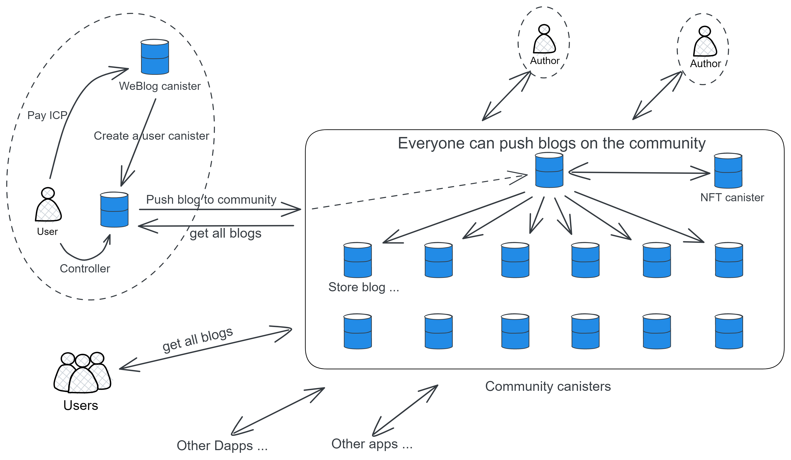

# NeutronStar

**A web3 Blog content aggregation platform on IC!**

> Distributed collaboration: contribute code to NeutronStarDAO to get token rewards.

Here is Chinese readme [中文版](README_zh.md) .

# Architecture

The project mainly consists of WeBlog, NeutronStar, and Seesset parts.

* WeBlog is an independent blog storage and publishing tool
* NeutronStar is a blog content aggregation platform
* Seesset is a NFT blog trading platform

### WeBlog independent storage:

The author's articles are stored in his own canister. Each WeBlog user can create his own jar to store his own blog and pictures. You can set a blog to be public, so that everyone can call the author's canister to browse the blog directly.

### NeutronStar community canister:

Authors can also push articles to the community canister for more people to see. Users visit the community's canister to read articles. Other clients can also get the content of the community canister.

These canisters of the community belong to NeutronStarDAO. The development team hired by NSDAO maintains and upgrades canister. NSDAO is also responsible for reviewing and deleting the content that everyone voted against (canister will be hosted by the team in the early stage, and NSDAO will be established later, and then handed over to NSDAO).

Readers can form different interest groups, small community exchanges and discussions, vote together, etc. according to the content of the articles.

### Seesset NFT:

After writing the blog, the author can choose to spend some NS to cast the blog into NFT.

### Open interface:

The interface of the community canister is open. Various front-ends can be connected to the community, and other types of platforms can also push their own articles to the NeutronStar community, obtain the list of articles and article content in the community, and complete interactions through this set of open interfaces: comments, likes, etc.

Data output by the public API:

* Ranking of the most recently published articles.

* According to the popularity ranking generated by the algorithm, it is determined by the number of views, number of likes, number of comments, number of comments, and likes of comments.

* The specific content, likes, and comment data of an article.

 

# economic model

The token name is NS . The total number of NS is 100,000,000.

* NS usage: participate in NSDAO voting, participate in NSDAO governance, reward authors, mint NFT blog

* NS source: Publish articles and get NSDAO approval, participate in blog review

Authors can publish ordinary blogs directly, or they can choose to mint blogs into NFTs (assuming it takes 10 NS to mint NFTs).

When people read the NFT blog, they will get a certain number of NS, first come, first served, and a total of 2 NS will be issued (burning 80% NS), which may be finished a few minutes later. **The reward mechanism is similar to the Bitcoin mining reward mechanism. At the beginning, the reading reward is the most, and then it will be reduced according to the logarithmic model until the NS is distributed. **

The more pageviews, likes, and comments the NFT blog has, the higher the price of the NFT may be, and the author can set a price for the NFT.

Everyone can bid to buy NFT to collect, and NSDAO will also buy NFT blogs (**NSDAO tends to actively collect various elite NFT blogs, attracting more readers and authors for the community, and a positive cycle. One possible situation is that people Competing with NSDAO to collect a good blog, just like an auction, the author decides who to sell to**).

In short, if the author thinks his blog is good, he can buy NS to mint NFT blog, and then sell NFT to make money; users read blog to get NS.

If the author has not minted NFT and feels that the quality of his blog is good after the blog is published, he can also apply for sponsorship from NSDAO.

NSDAO has the right to decide whether to issue additional NS tokens through voting, or directly burn tokens to resist excessive inflation.

NSDAO can take back some circulating NS by selling things. DAO recruits teams to produce some art NFTs, figures, peripheral products, novels, etc., and users can purchase them with NS.

NSDAO summarizes the year at the end of the year, and then votes for several high-quality blog authors to issue commemorative NFT and Token rewards.

> The role of DAO is to form and operate an autonomous community. Essentially, you get rewarded for contributing to the community. Governance contributions, article contributions, code contributions, participation in audits, and more.
>
> The economic model is for DAO. Macroscopically, the better the community develops, the more valuable the Token and the higher the price (generally, deflation is achieved through the combustion mechanism when user activity increases). After the Token is burned, the price rises, rewarding early holders and long-term supporters. Another aspect of the economic model is incentives. When there are fewer early users, a little more tokens are needed as incentives; after the number of users increases and the community matures, the number of incentive tokens will gradually decrease. For example, when the project was first launched, you could get 100 Tokens a day for participating in various activities, but after the project became popular, you could only get 7 Tokens for participating in one-day activities.
>
> If DAO uses the number of Tokens as the voting weight, one of the problems it faces is that there is a gap between the rich and the poor in society.
>
> If we assume that 10% of the people hold 90% of the wealth, and the other 90% of the people hold 10% of the wealth: that is to say, 10% of the rich have the ability to buy a large number of Tokens and directly control the right to speak in DAO. And ordinary people still hope that the token he bought can be multiplied several times, making him rich. Voting in the DAO is also insignificant, because even if everyone is united, it will only have 10% of the voting power.
>
> But if one person one vote is fair (even if the technology can filter all robots), it is likely to cause incitement of public opinion, troll shock......
>
> To be more balanced, add the number of pledged Tokens, pledge time, how many times you have participated in voting, whether you have recognized code contributions, and the length of time you have participated in content review in the community to the voting weight.

## Initiate a private space:

Create a private community canister in the community.

Only those who are invited by the creator have (subscription) canister access rights. Everyone in the space can post articles, and only other people in the space can see them. You can also post NFT blog. Canister control rests with the creator.

 

## Community NFT Badge:

Accomplish achievements to get your own exclusive badge: publish blog for the first time, comment for the first time, read more than 5000 articles...

 

---

The author can also initiate an auction application, vote in the community, and auction NFT blogs that people agree are excellent.
