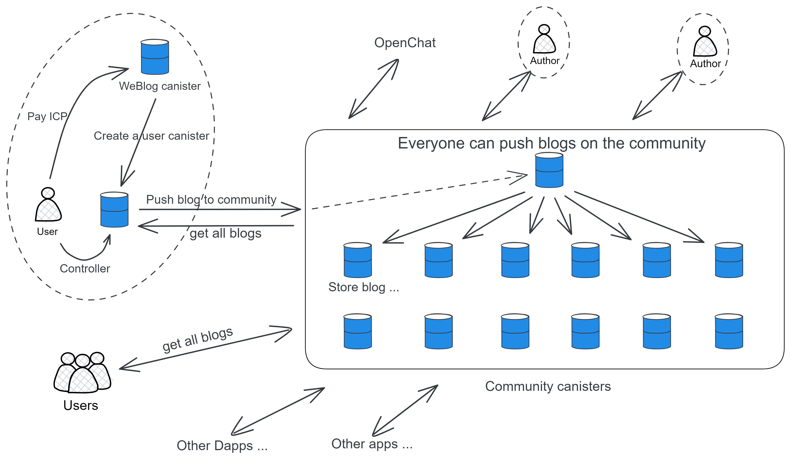

# NeutronStar

**A web3 Blog content aggregation platform on IC!**

> Distributed collaboration: contribute code to NeutronStarDAO to get token rewards.

Here is Chinese readme [中文版](README_zh.md) .

# Architecture

The project mainly consists of WeBlog, NeutronStar, and Seesset parts.

* WeBlog is an independent blog storage and publishing tool.
* NeutronStar is a blog content aggregation platform
* Seesset is a NFT blog trading platform

### WeBlog independent storage

Authors' posts are stored in their own canister. Each WeBlog user can create their own canister to store their blogs and images. You can set a blog to be public, so that people can access the author's canister to view the blog directly.

### NeutronStar community canister

Authors can also push articles to the community canister for more people to see. Users can visit the community canister to read the articles. Other clients can also access the content of the community canister.

These community canisters belong to NeutronStarDAO. The DAO hires a development team to maintain and upgrade the canister. NSDAO is also responsible for reviewing and removing content that people don't like when they vote (the canister is hosted by the team in the early stages, then NSDAO will be established and handed over to NSDAO later).

Readers can form different interest groups, small communities to discuss, vote together, etc. according to the content of the articles.

### Seesset NFT:

The author can choose to spend some NS to cast the blog as NFT after writing the blog.

### Open Interface

The interface to the community canister is open. All kinds of front-ends can connect to the community, and other types of platforms can push their own articles to the NeutronStar community, get the list of articles in the community, article content, and also interact through this set of open interfaces: comments, likes, etc. (but no NFT article series functionality).

Data output by the public API:

* Ranking of the most recently published articles.

* According to the popularity ranking generated by the algorithm, it is determined by the number of views, number of likes, number of comments, number of comments, and likes of comments (it also determines the price of NFT articles).

* The specific content, likes, and comment data of an article.

 

# economic model

The token name is NS . The total number of NS is 100,000,000.

* NS usage: participate in NSDAO voting, participate in NSDAO governance, reward authors, mint NFT blog

* NS source: Publish articles and get NSDAO approval, participate in blog review

Authors can publish ordinary blogs directly, or they can choose to mint blogs into NFTs (assuming it takes 10 NS to mint NFTs).

When people read the NFT blog, they will get a certain number of NS, first come, first served, and a total of 2 NS will be issued (burning 80% NS), which may be finished a few minutes later. **The reward mechanism is similar to the Bitcoin mining reward mechanism. At the beginning, the reading reward is the most, and then it will be reduced according to the logarithmic model until the NS is distributed. **

The more pageviews, likes, and comments the NFT blog has, the higher the price of the NFT may be, and the author can set a price for the NFT.

Everyone can bid to buy NFT to collect, and NSDAO will also buy NFT blogs (**NSDAO tends to actively collect various elite NFT blogs, attracting more readers and authors for the community, and a positive cycle. One possible situation is that people Competing with NSDAO to collect a good blog, just like an auction, the author decides who to sell to**).

In short, if the author thinks his blog is good, he can buy NS to mint NFT blog, and then sell NFT to make money; users read blog to get NS.

If the author has not minted NFT and feels that the quality of his blog is good after the blog is published, he can also apply for sponsorship from NSDAO.

 

## Initiate a private space:

Create a private community canister in the community.

Only those who are invited by the creator have (subscription) canister access rights. Everyone in the space can post articles, and only other people in the space can see them. You can also post NFT blog. Canister control rests with the creator.

 

## Community NFT Badge:

Accomplish achievements to get your own exclusive badge: publish blog for the first time, comment for the first time, read more than 5000 articles...

 

---

The author can also initiate an auction application, vote in the community, and auction NFT blogs that people agree are excellent.
