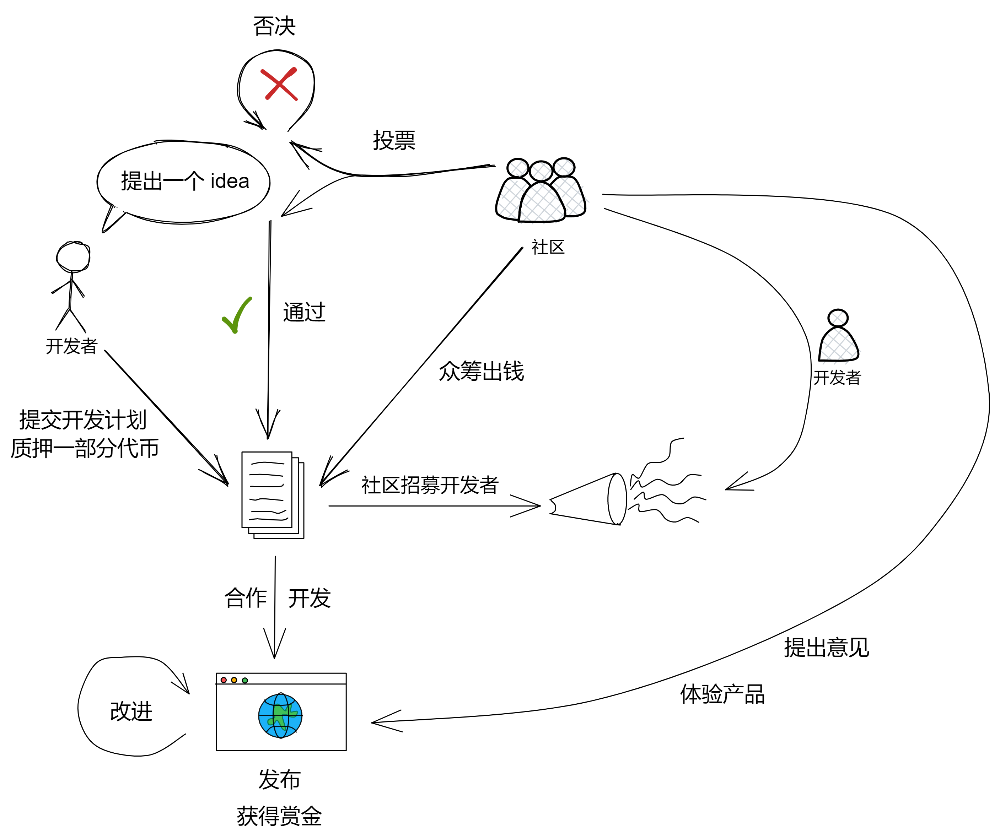

# ICWeBlog

**在 IC 上的 web3 Blog 社交平台！**

> 分布式协作：为 NeutronStarDAO 贡献代码可以获得 token 奖励。

# 架构：

架构如下图。

### 独立存储：

作者的文章储存都在自己的 canister 里。 每个作者有一个自己的罐子用于存放自己的文章、NFT 、图片。

### 社区公共 canister ：

如果作者要发布文章，就把文章内容从自己的 canister 推送到 “ 社区 canister ” 里。用户访问社区的 canister 来阅读文章。别的客户端也可以获取社区 canister 的内容。

社区的这些 canister 属于 NeutronStarDAO 。由 DAO 雇佣开发团队维护、升级 canister 。DAO 也负责审核、删除大家投票都不喜欢的内容。（前期由团队托管 canister ，后面会成立 DAO ，然后交给 DAO）

读者可以根据文章内容分类组成不同的兴趣小组、小社群交流讨论、一起投票等等。

### 开放接口：

社区 canister 的接口是开放的。各种前端都可以连接到社区，而且其他类型的平台也可以向 ICWeBlog 社区推送自己的文章，获取社区里的文章列表、文章内容，也可以通过这组开放接口完成交互：评论、点赞等等（但没有 NFT 文章系列功能）。

公共 API 输出的数据：

* 最新发表的文章的排名（最新的 25 篇文章）。

* 根据算法生成的热度排名，由点赞、所有用户的总阅读时长、评论数、评论字数决定，共同决定（同时也决定了 NFT 文章的价格）。

* 某篇文章的具体内容、点赞、评论数据

 

# 经济模型

Token 名称为 ICB ( ICWeBlog ) 。ICB 总量为 100000000 枚。

作者可以直接发布普通文章，也可以选择把文章铸造成 NFT 发布（假设铸造 NFT 花了 10 ICB ）。

当人们阅读 NFT 文章时，会获取一定数量的 ICB ，先到先得，总共就会发放 9 ICB（燃烧 1 ICB / 或者不燃烧，后期做更具体的调整）， 晚几分钟可能就被领完了。 **奖励和比特币挖矿奖励机制类似，最开始阅读奖励最多，到后面按对数模型减少，直到 ICB 发放完毕。** 读者必须在页面停留一段时间，并每隔30秒至少滚动一下屏幕才算 “ 阅读完成 ” ，直接滚动到文章底部也不算完成。（因为发奖励有阅读检测，所以通过公共接口接入的前端没有发布 NFT 文章的功能）

NFT 文章的浏览量、点赞数、评论数越多，NFT 的价格就越高，作者不能给 NFT 定价，NFT 文章的价格只能由系统算法决定。

**也就是说，NFT 文章质量越高，越火，它的价格就越高。**

所有人都可以出价购买 NFT 来收藏，DAO 也会用国库的 ICB 购买 NFT 文章（**DAO 会倾向于积极收藏各种精华 NFT 文章，为社区吸引更多读者、作者，正向循环。可能的一种情况是人们和 DAO 抢着收藏好文章，就像拍卖一样，由作者决定卖给谁了**）。

总之，如果作者觉得自己文章不错就买 ICB 铸造 NFT 文章，然后卖 NFT 赚钱；用户阅读文章赚 ICB 。

作者也可以用 ICB 为自己的 canister 充值 gas （由系统去兑换 cycles ，然后充值） 

 

## 发起私人空间：

在社区里创建私人社区 canister 。

只有受创建者邀请才有（订阅）canister 访问权，空间里的所有人都能发文章，只有空间里的其他人能看见。也可以发 NFT 文章。canister 控制权归创建者。

 

## 社区 NFT 徽章：

达成成就获得自己的专属徽章：第一次发表文章、第一次评论、文章阅读数超过 5000 ......

 

------

我认为这些做成 NFT 的文章都是人类智慧的结晶，这些好文章就像书一样，是有价值的，书有版权保护，在 web3 世界里，NFT可以赋予文章版权更多的想象力。各种好的 blog 是精华，精华就应该被收藏，精华是稀有的。

作者还可以发起拍卖申请，社区投票，把人们一致认为优秀的 NFT 文章拍卖。

人们可以发布自己的想法、笔记、思路：比如某个受欢迎的艺术家的日记，思想，感悟，思路做成一连串 NFT ，记录他的历程；评论绑定到文章，文章是 NFT 不能改变，但是文章的评论可以一直增加。

